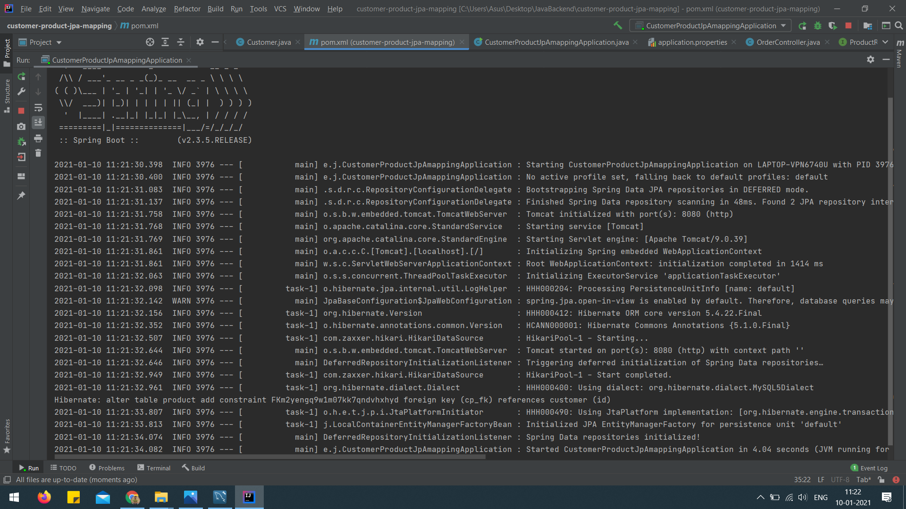

# Product Management Web Application
 Project includes one to many mapping of customers and products. Different  API calls for adding, retrieving, and updating information of customers and their purchasing in two different databases.
#Java  #SpringBoot  #MySQL(JPA Queries and JOINS)  #APIs

 
Project Architecture

 
Database with their tables

 
Customer table

 
Product table

 
Building and deploying spring boot application on local host 8080

 
Dependencies includes Lombok, MySQL Connector,Spring Web, JPA dependencies

 
Stand-alone application created through Spring Boot Framework

 
Customer class used as entity while creating table in database

 
Product class used as entity while creating table in database

 
Order Request class

 
Order Response class

 
Interface CustomerRepository extending JPARepository interface with explicitly defined query

 
Interface ProductRepository extending JPARepository interface

 
Controller handling different API calls

 
Defining required properties in appicationproperties

 
API call for localhost:8080/findAllOrders with response status 200 and Array of customers and products associated with it

 
 
 
 
 
 
API call for  localhost:8080/getInfo, returning array of name and product for each product

 
 
 
API call - POST request - localhost:8080/placeOrder with its JSON body

 
 
Response with status 200 OK 

 
 
API call for localhost:8080/findAllOrders with response status 200 and our newly added customer and related product are inserted in our tables i.e. in database

 
 

