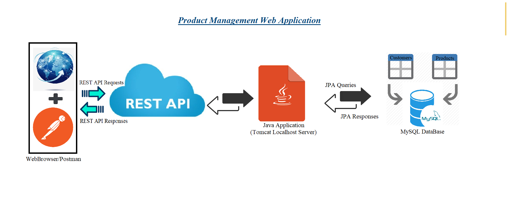
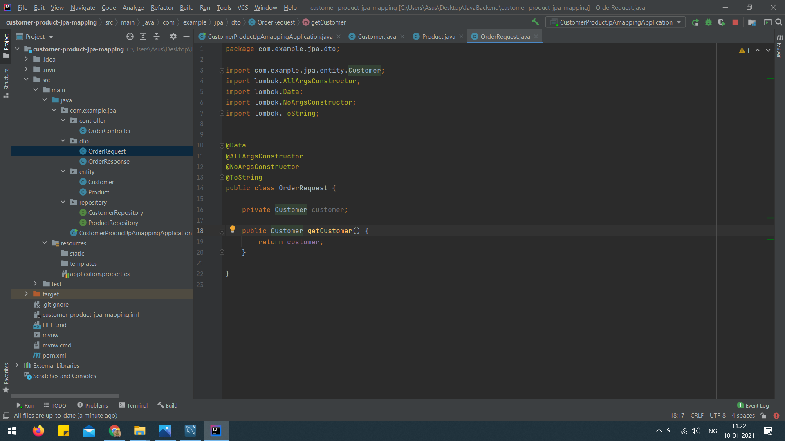

# Product Management Web Application
 Project includes one to many mapping of customers and products. Different  API calls for adding, retrieving, and updating information of customers and their purchasing in two different databases.
#Java  #SpringBoot  #MySQL(JPA Queries and JOINS)  #APIs

 
 
 
 
 
 
 
 
 
 
 
 
 
 
 
 
 
 
 
 
 
 
 
 
 

